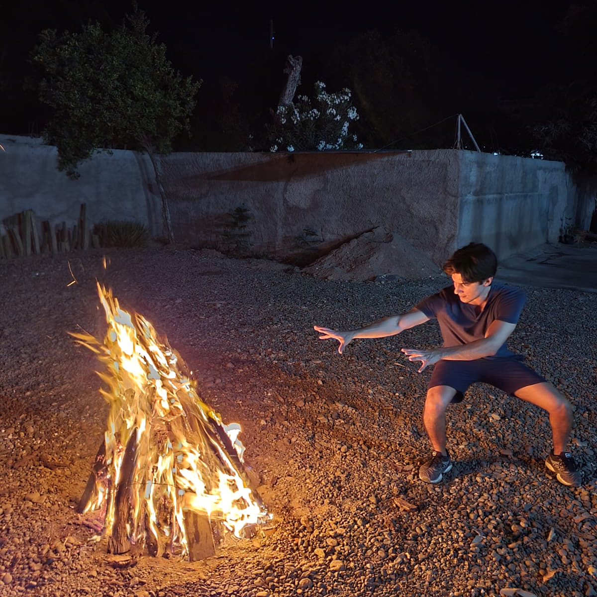

# About

My name is Everardo Castro Torres, I am from Sinaloa, México. I have the fortune to have lived, work and visit various parts of my country. I am deeply in love of its rawness, people and knowledge. I studied the Bachelor of Architecture at Universidad de Monterrey (UDEM), did an exchange program at Royal Melbourne Institute of Technology (RMIT) and have worked in Tulum, and Sinaloa as an architect, as well as developing my growing interest in experimentation with matter and making objects. 

I am very interested in working alongside nature to generate materials and new ways of experiencing spaces and objects, and therefore change our perspective of how we view our world. Currently I am developing a project where I design and create functional and sculptural objects made from wild clay that I collect, process, hand build and then wood fire myself in my pit fire kiln. I’ve also been experimenting with bacterial cellulose and fungi, and I am very excited by the possibilities of these and many more materials.

Ultimately my vision of the future is a place where our activities and creations, whether it is an object, a living space or a city, or even software and hardware do not alienize us from our planet, but bring us much closer to our nature, allowing humans and the other species to thrive in this interconnected world. I am very excited about the making possibilities of MDEF and the exchange of knowledge between people from different disciplines and parts of the world, and I am also very keen on getting my hands dirty!

Lorem ipsum dolor sit amet, consectetur adipiscing elit **[my website](https://community.emergentfutures.io/courses/5566525/content)**
