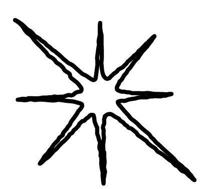

---
hide:
    - toc
---

# **Lab Solar**

<iframe width="1120" height="630" src="https://www.youtube.com/embed/KArslVCf2Sc?si=3zz8qnx-RN8bwdjE" title="YouTube video player" frameborder="0" allow="accelerometer; autoplay; clipboard-write; encrypted-media; gyroscope; picture-in-picture; web-share" referrerpolicy="strict-origin-when-cross-origin" allowfullscreen></iframe>

Fastness is not always equal to efficiency. In a world where we seek infinite productivity we fall into toxic practices of extractivism of finite resourceses and over energetical consumption.

**Lab Solar is a series of passive-tech artifacts which harvest the light and heat from our star in order to transform materials.**

With a true sense of regionalism and resourcefullness with what we have around, we could find a way of making and designing more in accordance with the planet we are.

### **Bringing the sun, the wind and the earth back into technology, in a respectful way, could renewal our bond as humans with what we call nature.**

This project seeks to **merge alchemy, technology, handcrafts and the concept of resourcefulness in materials and energy**, in order to generate new processes of making within our planetary boundaries. While doing so, it believes in the importance of taking care of the relationships we have with places, humans and non humans involved.

This project believes that the possibility of **energetic independence and economical relief through being resourceful and adopting passive methods can be a motivator for change on a bigger scale.**

It is based on the concept of **deriving pleasure from scarcity**, collaborating with others to craft items that promote wellness by becoming productive instruments of pleasure e.g. by heating, cooking, or manufacturing. 

<figure markdown>
  { width="400" } 
</figure>

### **WHY**

Returning to an idealized past (holocene) is not an option. We must think new ways of living in the anthropocene.  if our intention is to survive as a species on Earth we must rethink the modernist mostly western project of separating nature and culture. This involves rethinking our manufacturing processes and material world, and in doing so, rethinking the relationship we have with materials, energy harvesting and non human agents involved (living and non living, for example microorganisms or the sun).

Techologycal comodity bubble has in a way made ourselfs distant from our surroundings. We rely mostly on electricity driven aparatus that modify our materials and our environment. The fastness of availability gives us the illusion that resources are limitless taking us further away from the natural processes and the idea of being resourceful with what we have around. 

We will need to be more conscious and inventive with materials around us. We need to come back to a point where things are being reused, repurposed, grown or not produced in the first place.

What is required are optimistic strategies for change, actions driven by joy and pleasure, leading to a reduction feelings like paralyzing anxiety, fear, and guilt. 

### **PURPOSE**

- To redefine the relationships with materials and our ecological surroundings with the aim to bring us closer to our nature.
- To challenge the conventional notions of production and living in the Anthropocene era. By promoting alternative making processes and emphasizing the interconnectedness between nature and culture, it seeks to inspire a shift away from the modernist mindset towards a more symbiotic relationship with our planet.
- To inspire a change of perspective, providing alternative paths on the making process that are more in tuned with the planet we are.

### Artifact 1 (solar laser .analog)

<iframe width="560" height="315" src="https://www.youtube.com/embed/mcZvaZZ-cP4?si=wvY542CzSEGpOI7a" title="YouTube video player" frameborder="0" allow="accelerometer; autoplay; clipboard-write; encrypted-media; gyroscope; picture-in-picture; web-share" referrerpolicy="strict-origin-when-cross-origin" allowfullscreen></iframe>

### Artifact 2 (sunlighter)

<iframe width="315" height="560"
src="https://youtube.com/embed/dGf4Aa7snGs?si=LpKdRElUGUgpNwCu>"
title="YouTube video player"
frameborder="0"
allow="accelerometer; autoplay; clipboard-write; encrypted-media; gyroscope; picture-in-picture; web-share"
allowfullscreen></iframe>

### Artifact 3 & 4 in course, stay tuned...

### References:

https://solar.lowtechmagazine.com/low-tech-solutions/

https://pleasureinscarcity.danielparnitzke.de/

https://kayserworks.com/#/353628916383/

https://www.anupamakundoo.com/

