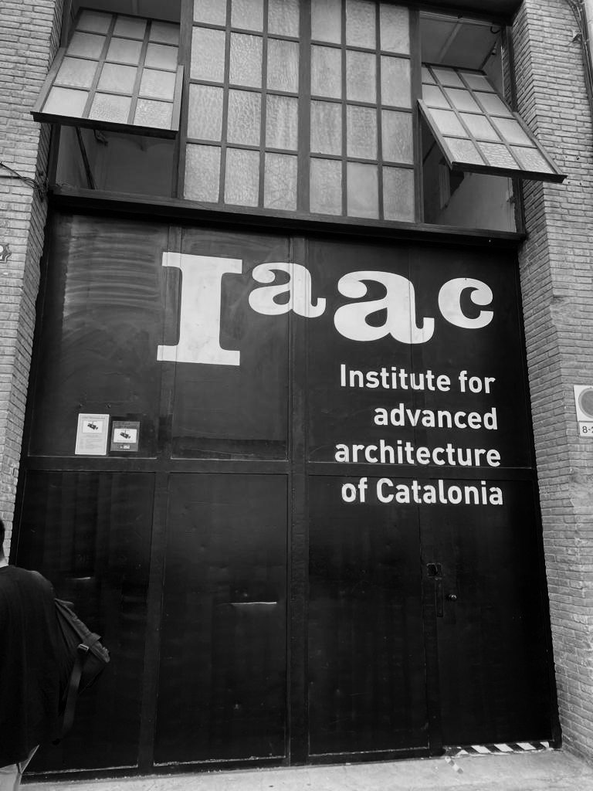
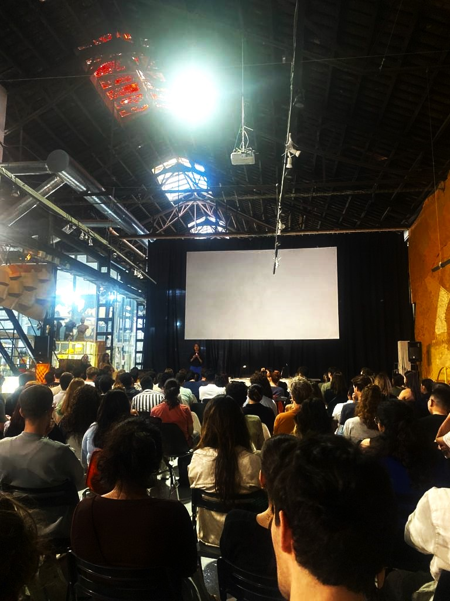

---
hide:
    - toc
---

# Landing...

<figure markdown>
  { width="700" } <figcaption>Perseverance rover landing on Mars</figcaption>
</figure>

The first week has been full of new topics, new people, new places. So far it has been very stimulating, I find it very helpful to get to know all the people and places that we can count on during this master. Also it has been quite challenging, as some of us are traveling across the planet to be part of this exciting project. With a new country come new cultural ways, new home, new friends, new food, so this week is the introduction to our new life basically.

<figure markdown>
  { width="500" } 
</figure>

## Day 1:

{ width="400";  margin-right="10px" } { width="400" }

We were introduced to the iaac family (students, directors, collaborators) as well as some of the infrastructure (the main building and nearby labs)
This was also the day when I met my classmates, we had the opportunity to bond, hang out and feel more comfortable around each other.

## Day 2:

We were able to see and hear a little bit of the members of the faculty, this was an introduction to each seminar and gives us a glimpse of what we can expect or explore.
We finished the day with an interesting exercise proposed by Laura Benitez, named “What’s your purpose” In which we had to bring a personal object that spoke about our interests, identity or daily life. I brought a picture of an earthenware vessel I hand built and wood fired in my adobe kiln back in Mexico. I tried to identify some of the contextual variables that influenced the existence of my object as life experiences, people, materials, places, in order to better understand its journey and therefore mine as well as my contextual reality.

## Day 3:

<figure markdown>
  { width="500" } 
</figure>

We were introduced in person to the master’s directors and the MDEF Faculty. It was nice to have a more personal approach with them and to hear about their journey and projects. 
We were introduced to the Poblenou District and some of the nearby galleries, labs and hubs. We met some interesting people and cool places where we can extend our work. 

## Day 4:

This was the documenting and presenting day. We had sessions with Pablo and Santi who introduced the webpage submissions methodology, as well as the importance of documenting everything, especially our failures, which are basically the turning points and the aha moments.

<video src="../images/Landing/landingvideo.mp4" controls title="Title"></video>

## Day 5:

{ width="400";  margin-right="10px" } { width="440" }

We visited the ELISAVA campus. This tour was very helpful to know all the tools and workshops that are in our disposition. I really liked the library, which is very extended and design oriented. We had a session with Laura that introduced us to other projects where we could collaborate such as the wet lab and others who work with a non-heteropatriarchal approach.

