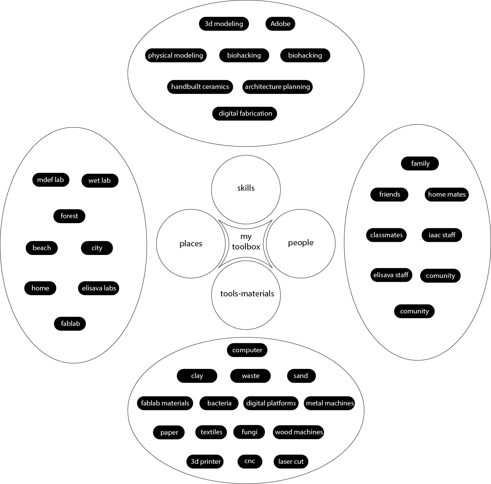

---
hide:
    - toc
---

# Design Studio

##FPP Approach
The first session of the design studio starts with the idea of taking the first person perspective (FPP) methodology as a way of living the design practice. The FPP allows you to be the subject of study and research with first hand experiences to be able to obtain and produce knowledge.

FPP:
It’s a way of acting 
It’s a way of looking at things
It’s a way of being involved

##Roles of Prototyping

FPP gives us a better understanding of certain object of study and allows us to be more efficient on creating prototypes which can defined by their different roles:

###As an experimental component

It allows us to create a physical representation of a case of study in order to probe different hypothesis.  
In my experience I have used this role as form finding in architecture through physical and digital modeling, in order to see how shadows, natural light, temperature and circulations interact with a building.

###As a means of inquiry

As instruments of inquiry that allow us to collect, record and measure phenomena.
This is a way of making a prototype with means of obtaining information even if we don’t have a clear goal or certain project in mind. For example, interviews and probes.

###As a research archetype

This is very similar to number two; the difference is role 3 help us to further explore a defined subject. Its goal is to be an embodiment of a concept, to be able to illustrate and explain it. It can create reactions as it was in the Autonomous tree project from Krzysztof Wronski.

###As a vehicle for inquiry

It is instrumental in doing design research. The prototype is the process itself and not the final product. The process is documented and analyzed in order to see why the results came up the way they did.
In my experience I can see it, for example, in the process of making an earthenware vessel, documenting the clay mixture ratio, the drying time, the temperature when burning, etc.

##My prototype

We have seen a great change on how we make and record music with the pass of time. Jorge had the idea to create a device that you could plug into your phone and work as a controller when making music with an instrument, eliminating the need for cables and sound mixer and increasing the accecibility in making music. 

This is a prototype I made to exemplify the idea of making music even more accessible by using your body as an instrument. The idea is you wear this device that can sensor your movements, rhythm and brain waves and translate them into sounds. It can also be used with your voice; you could sing a melody and it translates it in a selected instrument’s chords. 

<figure markdown>
  { width="300" } movement
</figure>

<figure markdown>
  { width="300" } voice
</figure>

##My toolbox

<figure markdown>
   
</figure>