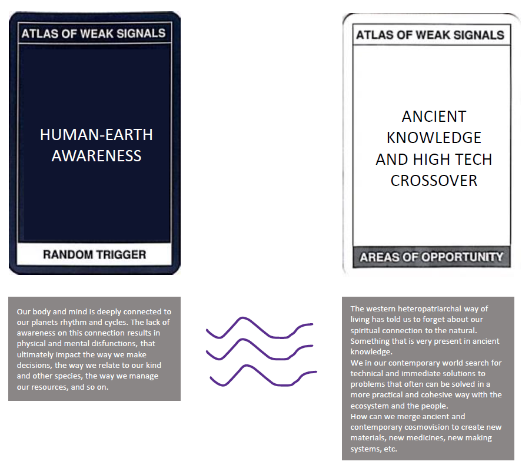

---
hide:
    - toc
---

# Atlas of Weak Signals

##Introduction

In this seminar we tried to identify our weak signals which are these indicators of possible change and
impact on the future. We tried to identify our own atlas of weak signals based on our own interests and
abilities on the present, but trying to imagine how they can be developed into further more elaborated
ideas and possible projects for change in the future.

It is worth mention the importance of the adoption of 1st person perspective in order to tackle big
problems like for example climate change, as it can help us break them down into smaller actions that
are more reachable to us and our community. These actions can then be replicated and escalated in the
future.

##AoWS_Group Exercise

We made an exercise in class using the AoWS deck as a way to start getting familiar to the methodology. We started
brainstorming on our perspectives about the selected weak signals; then we connected these WS with 2 areas of
opportunity and 2 random triggers, and started creating a narrative to come up with solutions.

<figure markdown>
  
  <figcaption>group exercise</figcaption>
</figure>

##AoWS_Self Exercise

<figure markdown>
  
</figure>

###new suggestions:
<figure markdown>
  { width="700" }
  <figcaption>new suggestions to the deck</figcaption>
</figure>

##Design Space

We can use AoWS (Atlas of Weak Signals) to imagine emergent futures, having a conversation with one self and create a Design Space. A Design Space is a visual map of ideas that sparks reflection and creates connection between concepts, references, materials, workspaces, technologies and possible contexts of intervention. Its goal is to be a tool that brings awareness to unconscious experiences, values and attitudes as designers in order to reflect about our practice and help us better understand our interests and potential of action.

We start by placing all of these concepts and physical components as materials and workspaces in a multiscalar map that allows as to see where we are standing and what tools are in our reach to the be able and represent the potential connections in a personal design space.

<figure markdown>
  { width="700" }
</figure>

<figure markdown>
  
</figure>

##Reflection

This exercise was more difficult than I thought it would be, as I think I have many different
interests, putting my brain in a visual workspace was a bit confusing but at the same time super
reflective and helpful. I think I’ve never been able to process all my ideas and interests to be able to
see a path or connection between them until now. I realize how much some of these concepts relate
with each other, and the realm of possibilities for change that can come out of them.

I also realize how many opportunities I have around me, how many actions can be made through
different spaces like iaac fablab elisava , the P oblenou spaces and also the power of community and
collaboration.

I know my design space is not as clear at the moment, and that it will mutate with time, knowledge
and experience, but now I see myself reflected and I have my intention and purpose more clear.

