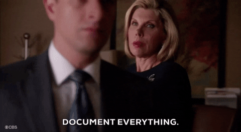

---
hide:
    - toc
---

# Documenting Design

<figure markdown>
  
</figure>

Pablo presented us some useful tools for documenting including different platforms, tips and tricks. He showed us different styles of practicing documentation. This was very helpful because everyone has a different way of communicating and understanding the subject. For some, visual representation is more useful, for others, words come out more easily, to put some examples. 

I think one of the most relevant point that was remarked was the importance of documenting itself. Documenting is very useful to have a record of a process and to keep track of the steps that were taken in order for the result could be accomplished. It is also very relevant to document the failures, as they are equally, if not more important for lesson learning and direction taking. 

In my experience documenting has been very useful but has also been a challenge. I have to get used to the idea of keeping record of my work, as well as being organized and clear at the moment of presenting it on a platform. The biggest challenge has been the developing of my own website, using mkdocs and Github without ever hearing about them before. 
I also have to admit that this exercise has been very enriching and fulfilling.

<figure markdown>
  
</figure>
