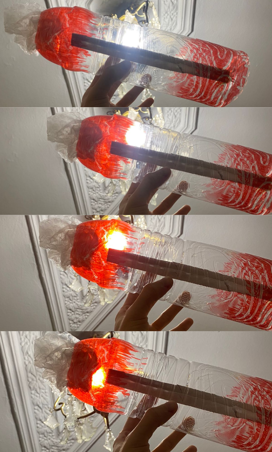
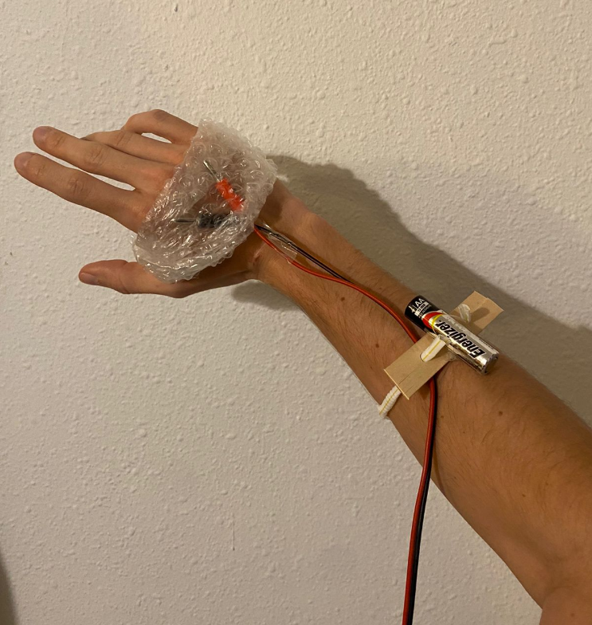

---
hide:
    - toc
---

# Living with your own ideas

## My companion
### How will you live together? 

One stays in my habitat (my room), to control my indoor atmosphere to match with the outside (nature’s rhythm)
One goes with me to give me the energy I need on the go.

### What does it notice? 
Sol- notices the imbalance with my circadian rhythm. It connects me with the sun's cycle.

<figure markdown>
  { width="500" } sol
</figure>

Flou- Translates my movements in different forms of energy: electric (so I can power my electronics on the go) sounds (so I can relax, concentrate, exercise in a fun way)

<figure markdown>
  { width="500" } flou
</figure>

### What were you thinking? 
Maybe I didn’t understand the assignment as I was in the bathroom, I need to communicate more.
I'm trying to make sense of my chosen companions. I started a bit messy but after talking with Oscar and Kristina I could make sense of it a bit more.

I try to translate my desire to achieve balance since my arrival in Barcelona, between the master, work, friends, family, rest, food, exercise, money, fun.

The idea was to create companions that help me achieve that balance, and make my life in the city easier and healthier, like a sort of survival kit in the city.

It makes me reflect on how can I import and adapt the habits I used to practice in my small hometown to Barcelona.

### Why does it matter? 
Personally, because that’s how I find peace, that’s how I feel serene and healthy. At the end, achieving this balance is how I will make the most out of this experience.

It leaves me wondering: is sacrificing things you enjoy doing worth it so you can achieve others? If so, what are my priorities then? How do you define your personal balance? Is it easier for you to achieve it? Are you needy like me?

# Reflections
### What did you make? And why did it matter?
I lived 24 hours with no clock and no artificial light. I wanted to see what happens if I let myself be guided by the daylight and night dark. I wanted to see how well connected I am to this cycle and how it influences my body.

The majority of species that live on the surface of the planet are biological interconnected with our star’s light and energy, in terms of the production of some vitamins and hormones as well as with our circadian rhythm.

I slept in the living room, as it is the most illuminated place by sunlight on the morning, in comparison with my room which is much darker.
At the end I woke up naturally with the sunlight but I went to my bed and slept a bit more. The reason I did this is because I didn’t have a good quality sleep, perhaps because of the sofa or because of the artificial street lights that came through the window.  When I woke up I had a hard time to get up because my room was totally dark. When I finally got up I had the idea to get a sun bath outside and it really made the difference. It allowed me to be more awake and energized.

I had some observations like how candle lights can give a cozier ambient and how their intensity and tone of light does not interfere with the production of melatonin, the hormone that helps us to relax our body and fall asleep. Talking with my roommates in our candle lighten living I could notice how our conversations deepened and even our voice tones became more neutral, it almost felt like when you have a dreamy talk (when you are half asleep and half awake).
With this exercise I could be more aware on how modern life disconnects us with our circadian rhythm because our day is full of artificial lights, screens and closed spaces that are not sensible with the importance of this relation between our body and the sun light cycle.  

### What happens when you involve yourself?  What happens when you use yourself as an instrument?
It allows you to get a deeper understanding of a certain subject because you have a bodily experience of it, and new ideas and questionings come up that wouldn’t if you had a more external view of the subject.

### Did anything change about your way of working?
This way of working gave me a new perspective of approaching my interests. Living with my own ideas and put them to practice. 

### What does it mean for your future work?
It means a more committed way of working. Be true and coherent with my ideals. 

### After seeing the videos of your design space collective, how does it change your understanding of it, present new opportunities or inspire new possibilities for collaboration?
After watching my classmates’ videos, I felt inspired, I could understand their interests and I couldn’t avoid to be related to some of them and how my interests could merge with theirs. I felt relatable with Nicolo´s approach with non-human entities and collaborations with machines. 
Anthuanet´s work on how rituals alter your senses and gives a more bodily connection with materials and actions. Ana´s view on how putting your body to its limits can relate to your emotions. Vania´s way of creating art with nature and waste. I can say that I could see a relation with almost all of my mates’ projects and different ways of how they can enrich my practice.

