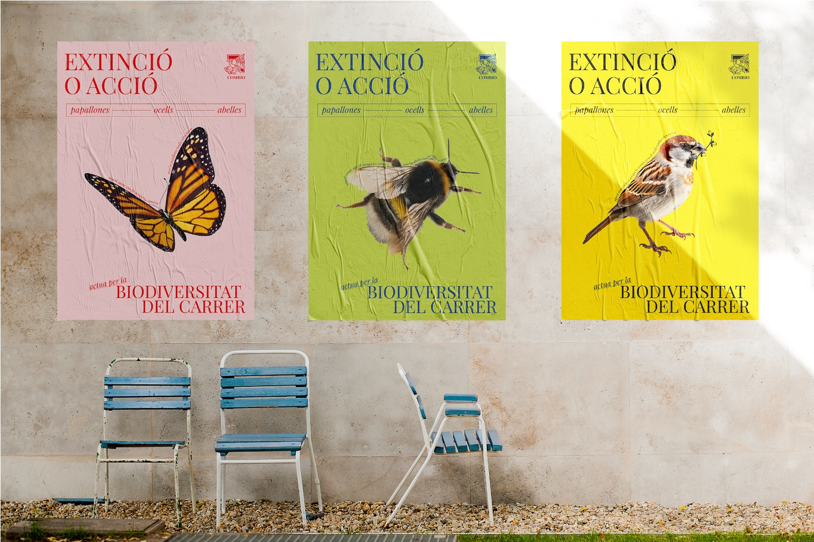

---
hide:
    - toc
---

# Design With Others

These are some of the pinpoints that stood up for me during Design with Others seminar:

-	Understanding design as a political practice

-	Questioning our role designing in complex assemblages:

Assemblages are composed of heterogeneous elements or objects that enter into relations with one another.
These objects are not all of the same type. 
Thus, you have physical objects, happenings, events, and so on, but you also have signs, utterances, and so on. While there are assemblages that are composed entirely of bodies, there are no assemblages composed entirely of signs and utterances.

-	Effectively integrating affected parties in design projects:

Active listening is a good practice for better understanding affected parties’ problems. It takes time, attention and care.

-	Sustain system's level intervening over long periods of time 

### It is important to acknowledge some of the limitations we face:

-	Real understanding requires bodily involvement

-	Deep change takes time

-	Meaningful connection requires attention and care

-	Impact requires practice

### Transitional Design

Transition Design is a transdisciplinary approach aimed at addressing the many ‘wicked’ problems confronting 21st century societies: climate change, forced migration, political and social polarization, global pandemics, lack of access to affordable housing/healthcare/education and many others. These problems are interconnected, interdependent and always manifest in place and culture-specific ways. 

<figure markdown>
  { width="500" } 
</figure>

- Wicked problems are at the root of many seemingly ‘simple’ problems we encounter at the level of our everyday lives (work, home, recreation, etc.) Transitional Design argues that solving for higher-level, wicked problems will have a trickle-down effect, solving for multiple problems simultaneously.

- Wicked problems must be framed within radically large, spatio-temporal contexts from the distant past (to understand how the problem evolved) into the long-term future (what we want to transition toward).
### ...ALWAYS QUESTION THE SYSTEMS

<figure markdown>
  
</figure>

# Reflections

## On Soil

In this seminar we focused on the subjects of land and soil. We went outside around the Sans area and observed moments where we could find friction or conflict between bodies and happenings revolving on the concept of soil.

Personally, I observed how bare soil and for thus vegetation is being marginalized and undervalued around the Sans area. I can understand that Sans urban configuration is rapidly changing, with many construction taking place, but this marginalization can be a reflection of what happens in Barcelona’s and most of the modern cities’ urban infrastructure. 

Soil is cleared and converted into inert material surfaces such as roads, sidewalks and buildings. And when vegetation is included, it takes very constrained spaces only for tree planting, leaving many of the native medium and small size flora like bushes out of the urban panorama, and in many cases, these spaces are used by people as secondary garbage collectors.

## On Land

It was very interesting to visit La Borda, a cooperative living located in Sans. Seeing this housing system opened the eyes for me, especially on how well structured and organized it is, from the political and economic level, to the neighbors agreements. Personally this is something that I would love to be involved in. I’m a firm believer on how community and cooperation can make our lives easier and happier. 

Architecturally speaking, this building is very well designed. I can say a lot of things that stood up for me, for instance, the fact that it is the tallest building made with structural wood, its central patio which encourages gathering, its bioclimatic systems, the flexibility of the units floor plan, the materials economization, and so on…

La Borda is for sure a great example on what community gathering and organization can accomplish. 

# Intervention

We focused on the issue of marginalization of wildlife in the city, specifically diversity in plants and pollinating species like bees, butterflies and birds. 

The objective of the plan is to engage both Nest City Lab and BAM into a collaborative process with us and the neighbors of this area in Poblenou to reimagine the street they share and come up with designs to potentiate biodiversity of pollinating species.

At the beginning we were planning on coming up with design and solutions ourselves, but we realized that it is more congruent to first take this approach of involving the community through activities and interventions, in order to generate conversation and participative design.

<figure markdown>
  { width="500" } 
</figure>

### Mapping the conflict

<figure markdown>
  
</figure>

### Action timeline
<figure markdown>
   
</figure>

### Actions
<figure markdown>
   
</figure>

<iframe width="560" height="315" src="https://www.youtube.com/embed/FUPg-zJ5T0o?si=MnWamFNwUv038xbo" title="YouTube video player" frameborder="0" allow="accelerometer; autoplay; clipboard-write; encrypted-media; gyroscope; picture-in-picture; web-share" allowfullscreen></iframe>

