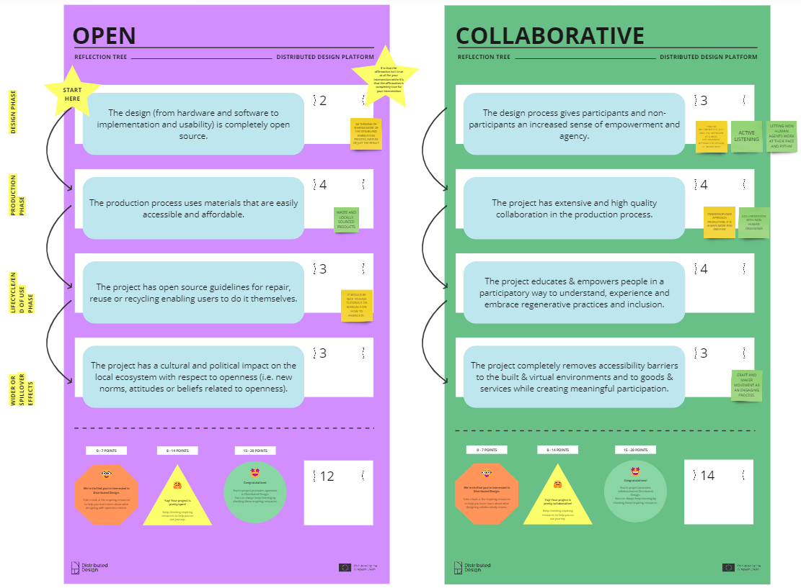
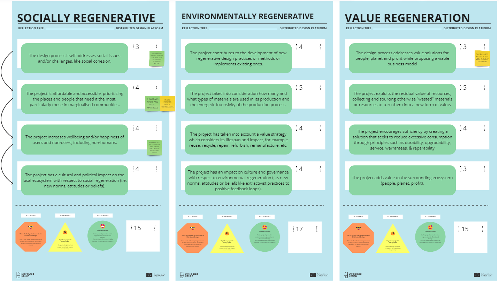
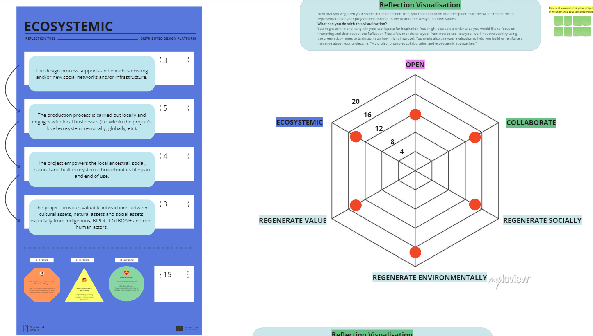

---
hide:
    - toc
---

# Design with Values

### Distributed Design Platform Reflection Tree

<figure markdown>
  
</figure>

<figure markdown>
  
</figure>

<figure markdown>
  
</figure>

### What are the key takeaways from the activity?

For me this exercise was very helpful tool to put my ideas in order to come up with a clearer panorama of what I want to work on for my main master project. I liked the fact that it happened this way around because it made me reflect on the impact I want to create beforehand. In my case, the scores are speculative as this project is not yet developed, but they represent a reflection of how I envisioned it in my mind at that time.

### Feedback on the Reflection Tree? 

In my personal experience I would suggest to make a version for speculative projects or ideas, as I was using it that way. Maybe it is not the main focus of this exercise but it is the only suggestion I have.

