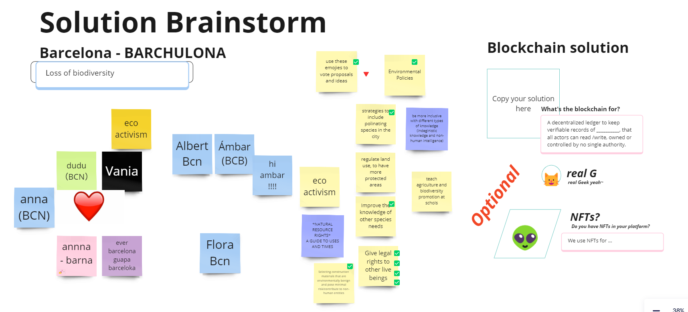
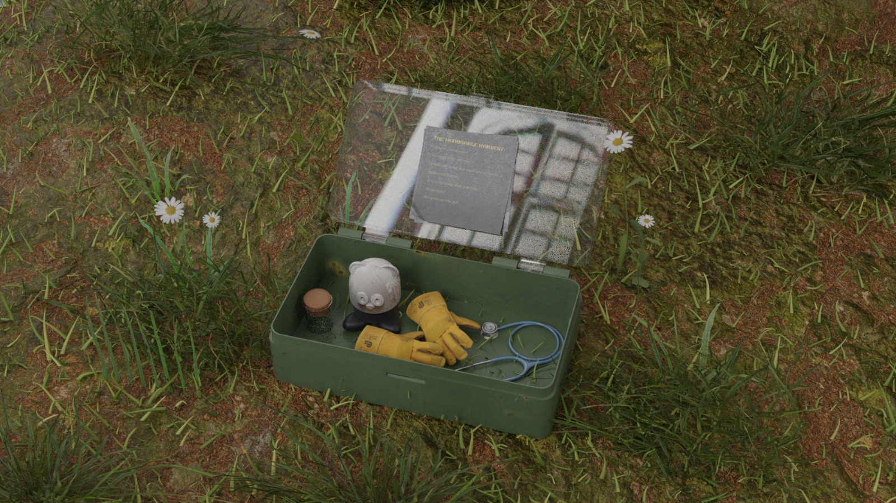
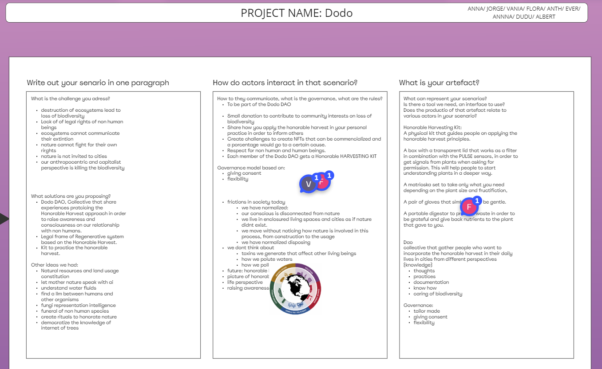
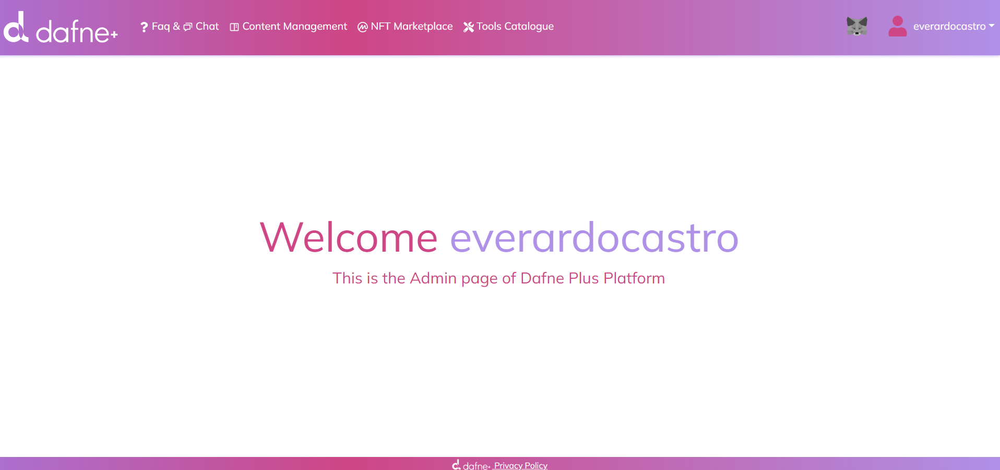

---
hide:
    - toc
---

# Fair Futures

### Organizing through common interests

<figure markdown>
  
</figure>

### Honorable Harvest based DAO and Kit

<figure markdown>
  
</figure>

<figure markdown>
  
</figure>

### Dafne platform profile

<figure markdown>
  
</figure>

### Reflections

It was interesting to know more about blockchain based models, where internal organizations can be created (DAOs). This model represents a paradigm shift in how we organize and govern collective efforts. By embracing decentralization and transparency, these organizations have the potential to revolutionize traditional business models and empower individuals to participate in collaborative endeavors on a global scale.

Personally, I wasn’t familiarized with these concepts before, and it was helpful to do a practical exercise to apply them. 

