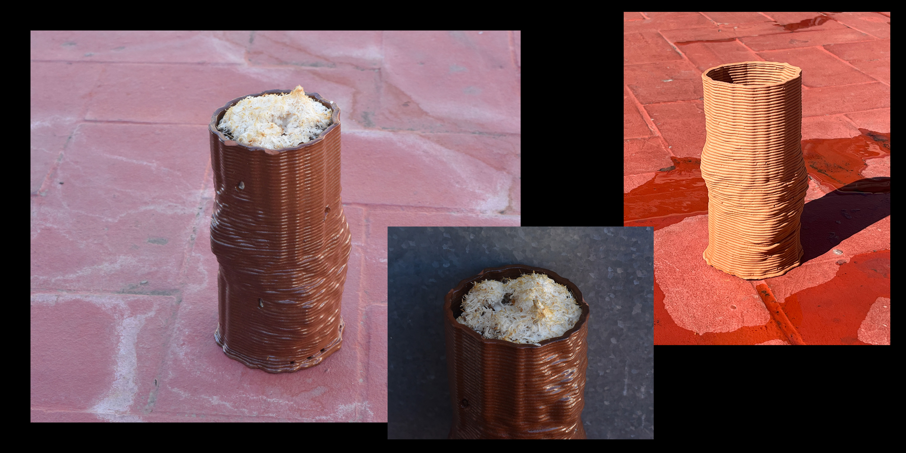

## Paste printing a vase for mycelium fructification

<figure markdown>
  
</figure>

***Project by: Annna Lozano Martínez, Nicolò Baldi, Everardo Castro Torres & Jorge Muñoz Zanón***

#### Reflection

Paste 3D printers offer a world of possibilities by handling diverse materials like clay, silicone, and even biological substances. This technology empowers us to explore new frontiers in creativity and innovation. With paste printing we can achieve personalized objects with unique textures become achievable. However, hacking and using 3D printers for clay printing involves technical challenges such as the modification of the equipment and the slicing software settings (grasshopper or cura). Despite these hurdles, hacking a 3D printer for clay opens doors to crafting intricate ceramic or paste-printed objects with revolutionary designs, igniting a fresh wave of imagination and discovery.

In our project, we explored blending traditional materials, advanced tech, and living organisms. We created a structure that joins ceramic arts, 3D printing precision, and mycelium natural growth. Our main challenge was using clay in 3D printing, which required rethinking design to clay's properties and 3D printing specifics. We aimed for stability and strange shapes despite common issues like collapsing structures. Grasshopper, was our help for that, enabling rapid design iterations for the structure.

#### You can check the github repository by clicking the following link:
https://github.com/niente010/3D-Clay-Printing/tree/main/Images 

