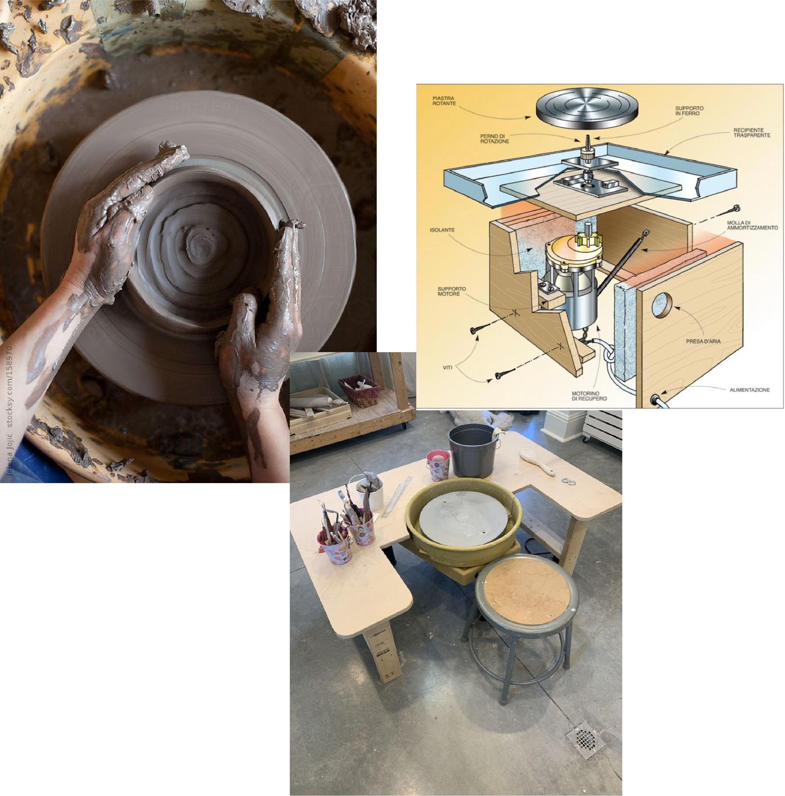
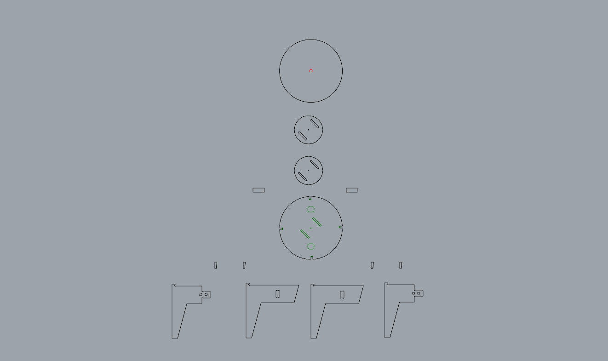
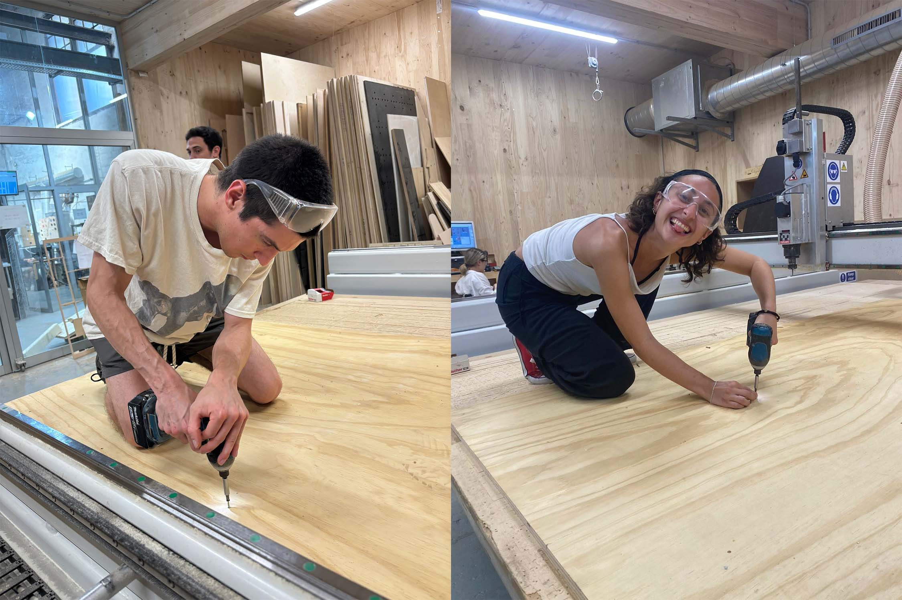
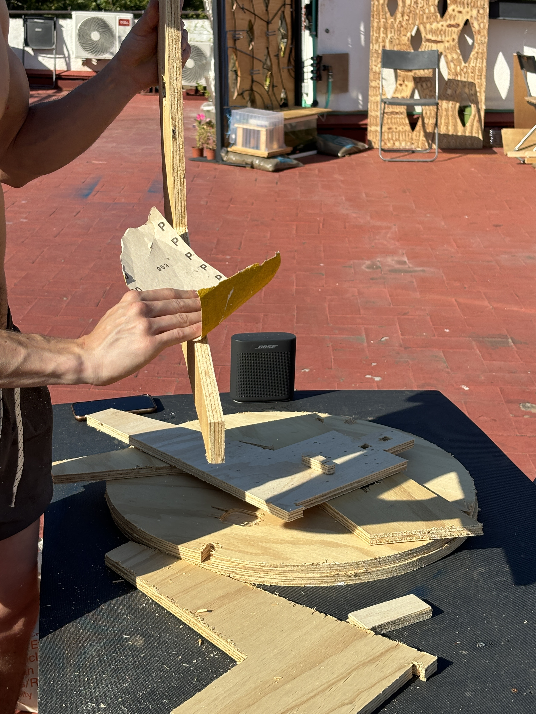
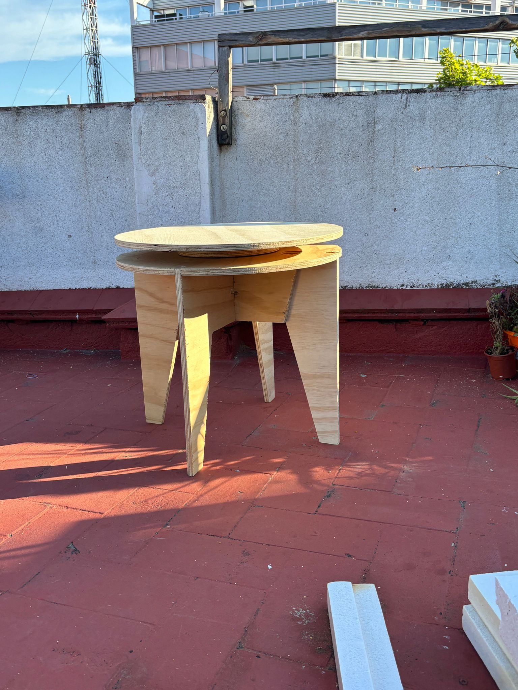

### Pottery Wheel
Project with: Jorge Muñoz Zanón, Ana Fedele, Sophie Marandon, Nicolò Baldi, Annna Lozano

<figure markdown>
  
</figure>

In this module, we undertook the design and development of a custom spinning table using CNC milling machine. This table is equipped with a mechanism that includes a spinning edge and bearings, ensuring smooth manual rotation.

## Concept and Design
We designed it as a manual pottery wheel that could be placed at any setting and that would be both aesthetically pleasing and functional. We aimed for the spinning feature to operate smoothly, offering an effective interactive experience. Whether serving as a table or a pottery wheel, it needed to seamlessly integrate aesthetics with mechanics. 

<figure markdown>
  { width="500" } 
</figure>

<figure markdown>
  { width="500" } 
</figure>

## Process:
<figure markdown>
  
</figure>

<figure markdown>
  
</figure>

CAD Modeling: Detailed CAD drawing were created to plan the machining process.

G-CODE making: Using the CAD drawing of every piece, a CNC program was written to guide the machining process.

Material measuring: Wood pieces provided were measured to make sure the tolerances determined on the CAD drawing were correct.

Machining: Components were machined setting up the g-code.

Post process: Sanding was needed to ensure correct fitting of the assembly.

Assembly: Once all parts were machined, the assembly of all parts was made.

## Difficulties:

We had the problem of the tool selection for the CNC milling. The tool was not ,the right one for cutting smoothly, which ended up in rough edges. A lot of sanding was needed after.

Although we anticipated that achieving the spinning functionality would be challenging, the outcome did not meet our expectations. This might have been due to the quality of the bearings. Since we used bearings available in the lab, they were not properly lubricated, which resulted in imperfect spinning.

Taking all this into account, even though we didn't achieve the desired result, we are proud of our accomplishment in assembling the piece of furniture, especially considering it was our first experience with this machine.

<figure markdown>
  { width="500" } 
</figure>

<figure markdown>
  { width="500" } 
</figure>

