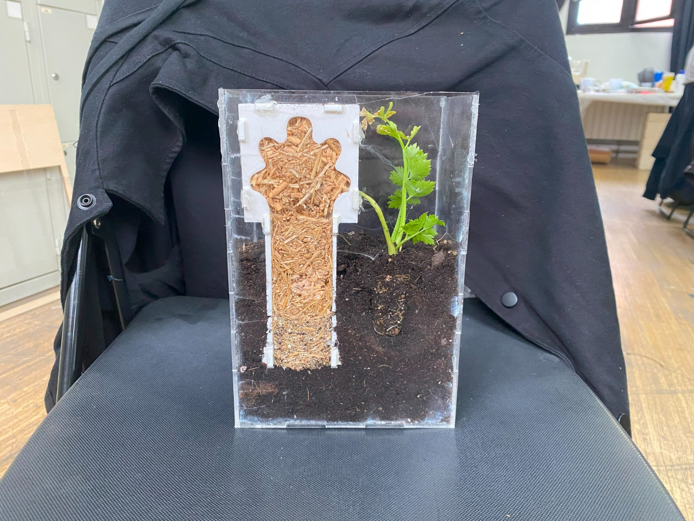

## Myco-Farm

<figure markdown>
  
</figure>

Project by: Everardo Castro Torres & Jorge Muñoz Zanón

The following project tries to put to the test a new way of manufacturing. Based on the growth of mycelium, this project offers a different approach to grow mycelium than doing it in a Lab.

By planting molds to the soil connected via 3d printed clay structures that allow mycelium to both, grow through the mold and expand its net to eventually connect to the mycorrhizae. This method, allows exchange of nutrients between the mold and the natural ecosystem. Through this artifact we explore the idea of taking resources in a more responsible way, exchanging nutrients and the new mycorrhizae network for a desired object, fruit, etc... Further research is needed in order to not alter the ecosystem's balance (fungi species, plant species).

#### You can check the github repository by clicking the following link:
https://github.com/jmuozan/Myco-farm

