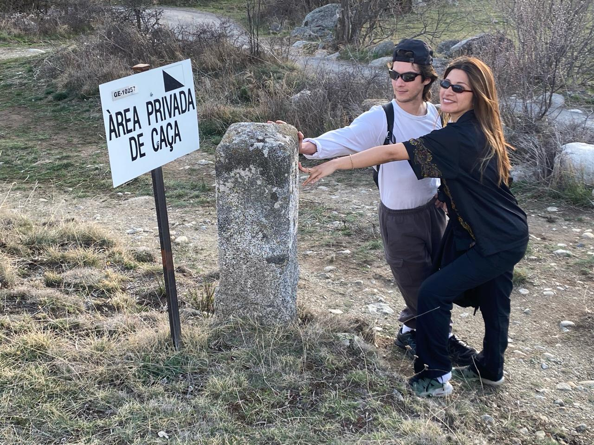

## Rewilding the Sensetive Landscape _ Research Trip
By Anthuanet Falcon & Everardo Castro

Exposing our senses to the environment, allowing us to interact, observe, and interpret it with heightened sensitivity, expands our perception for exploring various active agents in the landscape, from the micro to the macro level. Symbiotic living systems continually co-create with the environment. In our experience, this was evident in the mountains of Angoustrine-Villeneuve-des-escaldes, at the border between the French and Catalan Pyrenees, suggesting shared microclimates bridging the gap between the wild and the domesticated.
"Rewilding the Sensitive" interprets the necessity of connecting with the environment through sensory language and symbiotic matter. Based on this principle, we developed a series of interventions with the intention of materializing our interpretations.

### Rewilding touch.

9 a.m. It's a sunny and mild morning. You find yourself enjoying a cup of ginger tea on the patio of La Grande Maison Rouge. Coming from the city, your desire to head to the mountains is inevitable, so you decide to explore the terraces of the place. The distant sound of the stream accompanies you on your journey, while the song of birds and the wind among the trees invite you to pay closer attention.
You settle down for a moment, taking it all in, and begin to contemplate and observe. You start to notice the ground moving, so you take a closer look and find yourself in another world teeming with micro-insects and micro-moments. You begin to touch the ground covered in a carpet of grass and leaf litter. Your inner child has awakened, you get carried away by curiosity and you take off your shoes and socks.
You stand up, and the sensation is strange; the soles of your feet are no longer confined by shoes or in contact with flat, polished surfaces. Confused by this feeling, you take your first steps and notice how the muscles in your toes begin to activate. As you ascend higher through the forest barefoot, your body's anatomy begins to be engaged. The materiality of the space starts to be perceived by your feet, and your perspective begins to shift.

### Path for rewilding touch.

Mix between compost, clay, and dirt. This path invites us to bare our feet in the wild and experience the sense of touch not only with our hands. The mixture, being moist, behaves with a certain plasticity thanks to the clay; the soil provides nutrients, as well as the compost which also provides plant fibers that, when dried, give firmness to the body while also providing a certain softness and cushioning when stepped on.
The intention of this path is to be an alternative to those made with stone or concrete, which are very solid and reach high temperatures in the sun. It is a more comfortable and free option without losing connection with the environment, for barefoot walking in the mountains, where there are spiny and rough textures, as well as human waste that can cause harm when in contact with the skin.

### Soil, compost and living systems.

After exploring our encounters with the environment, we became interested in the micro world and its interactions between the landscape and us as active agents. The plant world, the soils and their mysteries, the surfaces that generate life, such as animal droppings from the landscape like those of cows, deer, and horses in the area, within which we discovered the fascinating world of compost, living systems co-creating such as mycelium and roots coexisting to generate life in the collective and interconnected soil system. Technologies from microorganism cosmos not perceived by humans.

Upon encountering our collective observations, we decided to experiment with symbiotic matter through our curiosities and personal interpretations. Everardo explores with wild clays from different places, testing their properties such as plasticity, color, texture. At the same time, the integration of clay with mycelium. while Anthuanet explores plant cognition and root habituations during their growth, exploring their interaction in different types of soils and other living organisms. This combination of approaches motivated us to travel in our experimentation with the symbiotic matter of the area.
First, we went to look for symbiotic materials from the area, starting by involving ourselves with the community of the town. We went to the tree nursery where baby trees grow for reforestation. With them, we identified different types of soil, distinguishing three types: one belonging to the mountain, another to the nearby farms, and another from the nursery itself, differentiated by different amounts of soil, clay, sand, and organic matter.

Subsequently, we went to Poterie La Ferme, a ceramic workshop where Jaume and Nuria kindly gave us some clay from their studio and fertile soil from their garden to experiment with. After obtaining these elements, we decided to search for our life-generating surfaces (animal droppings or caca) and observe their behavior through our mixtures.
The pieces form a collection of structures intended to understand their plasticity and integration with systems of other living organisms.

***Mixes: Clay + Compost (caca)+ seeds +dirt from different soils + sand + fibers.***
***Technics: Handcrafs, woodfire ceramics, low tech***

### PDF presentation 

<iframe width="100%" height="800" src="../../files/REWILDING THE SENSITIVE LANDSCAPE.pdf"></iframe>

<figure markdown>
  
</figure>

