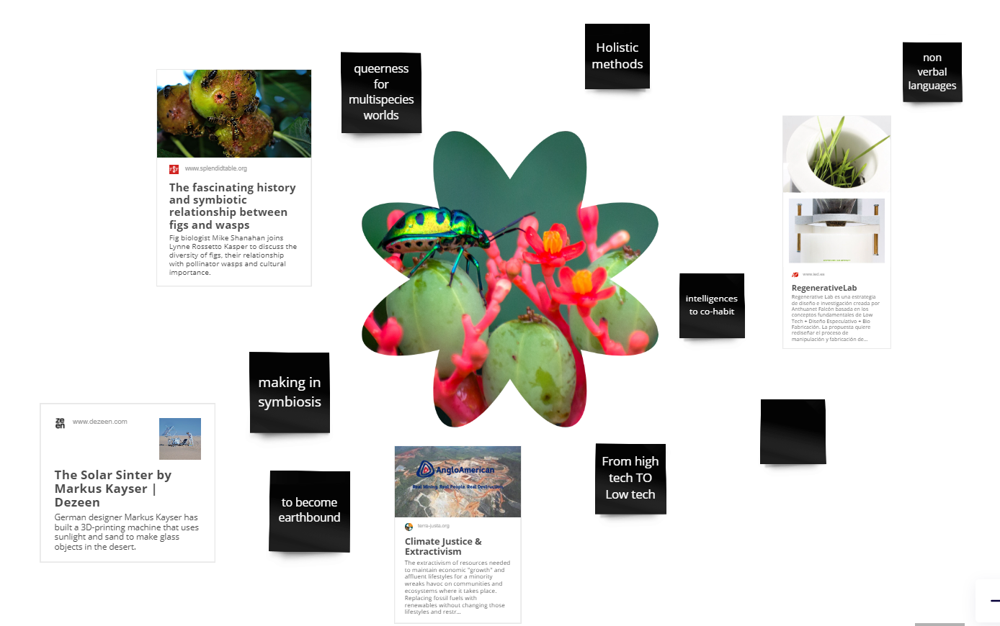
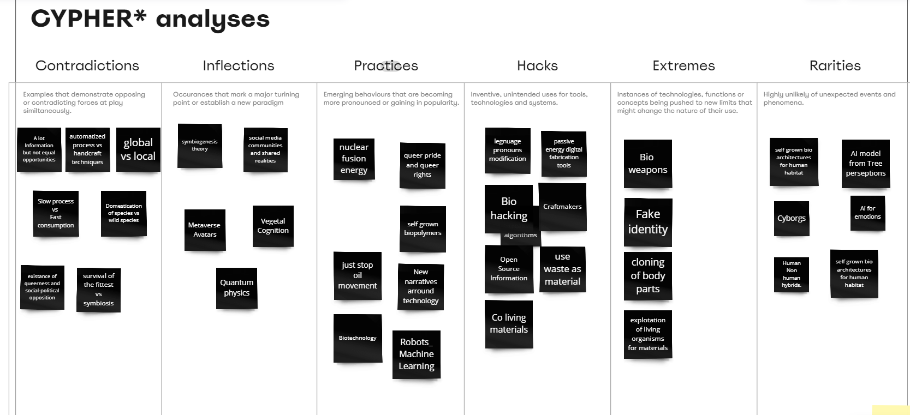
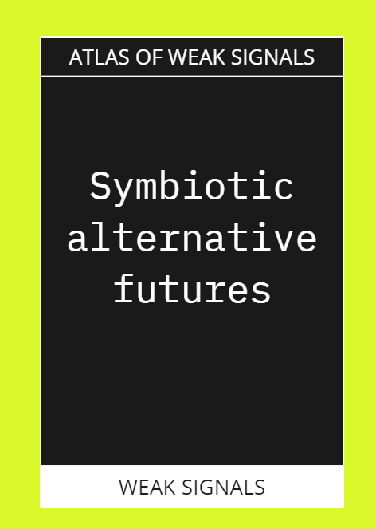
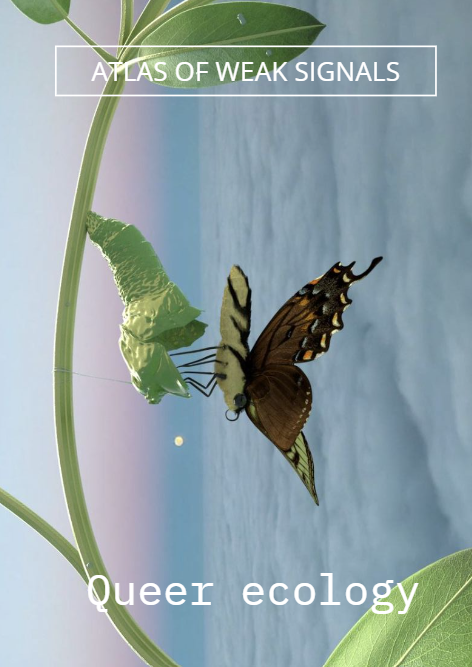
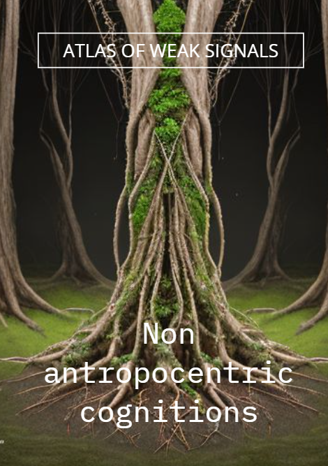
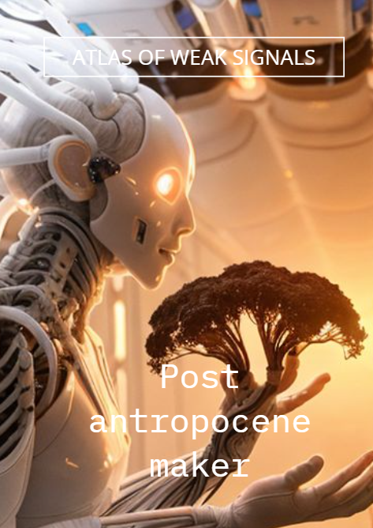
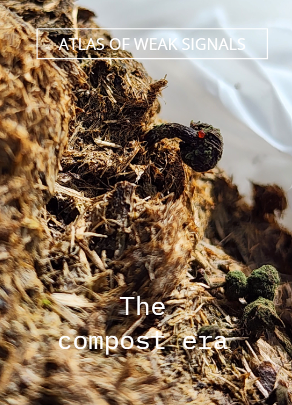
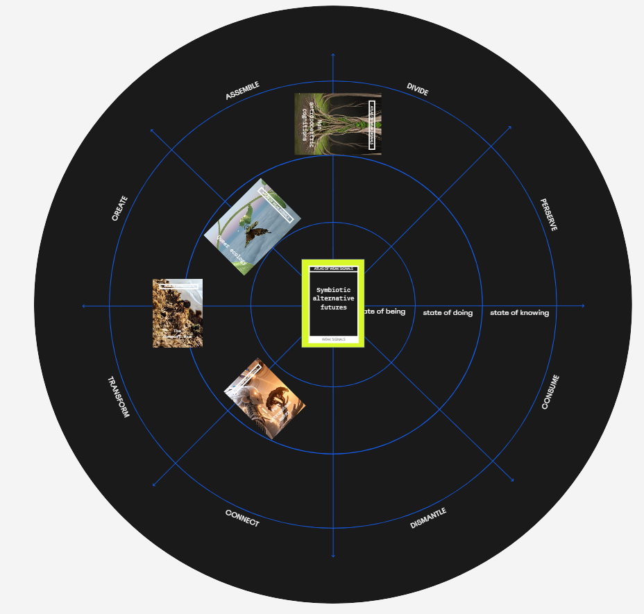

---
hide:
    - toc
---

# Atlas of Weak Signals

### Themes Selected

**Queer Ecology**

In an era of shifting paradigms, Queer Ecology emerges to challenge established norms and classifications, advocating for a broader perception of sexuality, gender, and other human categories. It encourages us to rethink living beings, evolutionary processes, and ecological interactions through the lens of queer theory, aiming for a more diverse and flexible scientific narrative. Queer Ecology prompts us to question arbitrary boundaries and dismantle false dichotomies, recognizing the inherent strangeness in nature.

**Understanding other Species cognitions**

Throughout history, humanity has forged an intimate and creatively inspiring connection with nature, giving rise to biomimicry. However, beyond merely emulating nature's examples in terms of planning systems, forms, textures, and functions, there lies a deeper aspect that eludes human understanding: the consciousness underlying these systems and their ability to maintain balance with the planet. This lack of comprehension is prompting questions about the cognition of other systems, as it confronts us with the complexity and depth of the intelligence inherent in nature.

**Post Anthropocene maker**

alternative methods of production that respond to the current context of hyperextractivism on a planetary scale, through earthbound resourcefull methods. Working with passive technologies, renewable energies and materials, social-biological-environmental councoius process.

<figure markdown>
  
</figure>

### Framing Signals

<figure markdown>
  
</figure>

### New Weak Signals

<figure markdown>
  
</figure>

<figure markdown>
  
</figure>
In an era of shifting paradigms, Queer Ecology emerges to challenge established norms and classifications, advocating for a broader perception of sexuality, gender, and other human categories. It encourages us to rethink living beings, evolutionary processes, and ecological interactions through the lens of queer theory, aiming for a more diverse and flexible scientific narrative. Queer Ecology prompts us to question arbitrary boundaries and dismantle false dichotomies, recognizing the inherent strangeness in nature.

<figure markdown>
  
</figure>
Throughout history, humanity has forged an intimate and creatively inspiring connection with nature, giving rise to biomimicry. However, beyond merely emulating nature's examples in terms of planning systems, forms, textures, and functions, there lies a deeper aspect that eludes human understanding: the consciousness underlying these systems and their ability to maintain balance with the planet. This lack of comprehension is prompting questions about the cognition of other systems, as it confronts us with the complexity and depth of the intelligence inherent in nature.

<figure markdown>
  
</figure>
alternative methods of production that respond to the current context of hyperextractivism on a planetary scale, through earthbound resourcefull methods. Working with passive technologies, renewable energies and materials, social-biological-environmental councoius process.

<figure markdown>
  
</figure>
In today's world, we often prioritize long-term non changing materialities like plastics and rare metals as well as squared and stiffed institutions. We find ourselves reliant on outdated systems that have ceased to function effectively. As we embrace the need for transformation, flexibility, adaptability, and renewal, we stand on the brink of a new era

<figure markdown>
  
</figure>

### Reflections

It was interesting to think about these new signals, which are essentially new trends, in this case, focused on possible futures and shifts that are occurring in systems and ways of living. For this exercise, Anthuanet and I partnered together because we have several common themes. We are both interested in bioprocesses, and how these new ways of interacting with natural agents allow us to expand our understanding of other non-human intelligences and the functioning of systems involving agents such as the sun, wind, and the water cycle on the planet. At the same time, thanks to our work with microorganisms and compost, we see this vision of matter transformation, discussing how death gives life to new systems. We see this as a philosophy of life that can be applied in multiple layers.
I consider that the exercise has a structure that guides and helps understand step by step the identification of these new trends. I consider the openness of the exercise important to allow each person to contribute with their topic of interest and greater knowledge. At the same time, this also allows the combination of ideas and the formulation of weak signals with more depth and a more interdisciplinary approach.

Identifying weak signals can help focus our interests on certain topics that represent opportunities for intervention and change. Making it collaborative makes it even more interesting because you can understand the thought process of other disciplines and also allow yourself to be influenced by them, changing your perspective to a more holistic and better-supported one.

