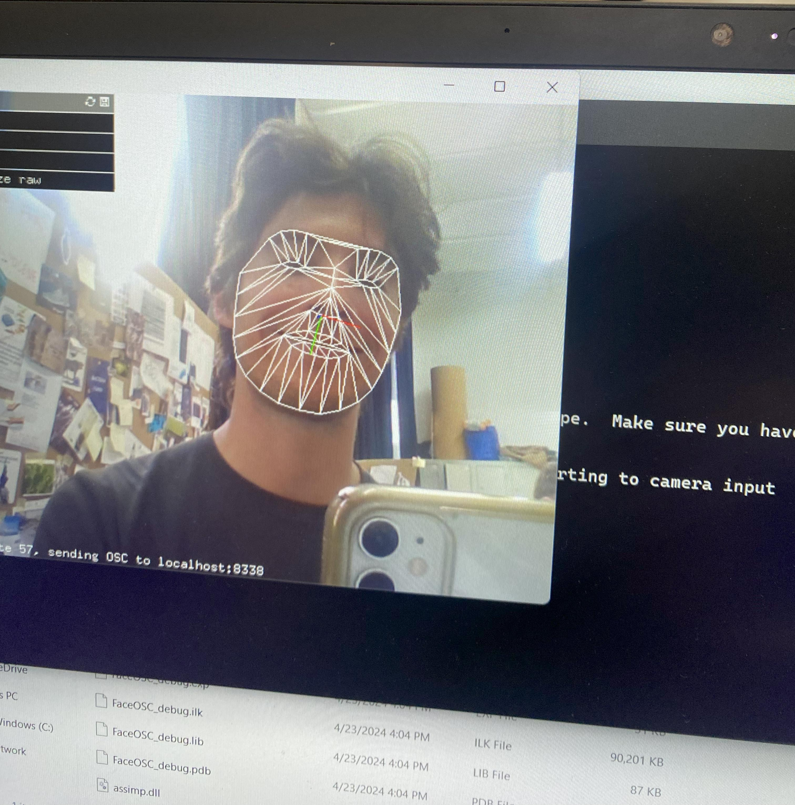
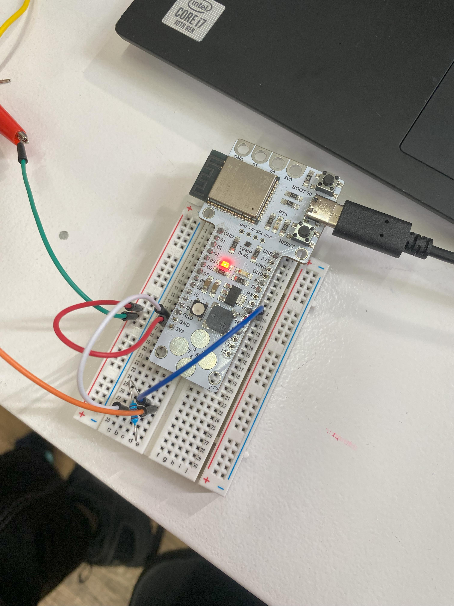
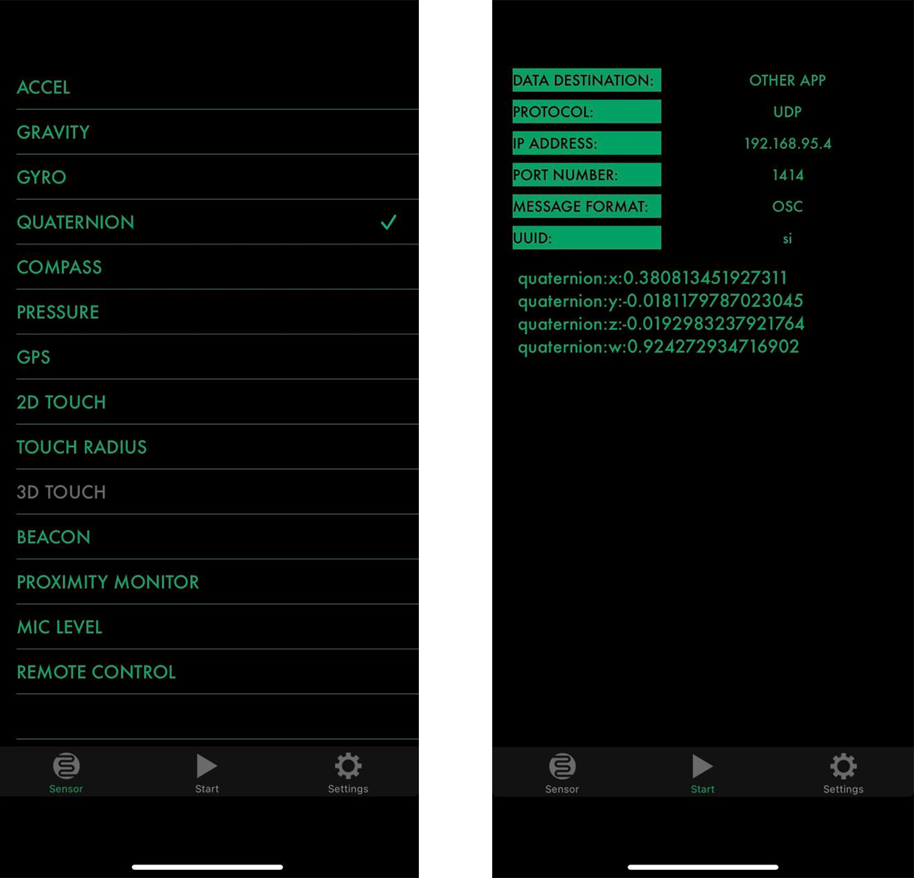
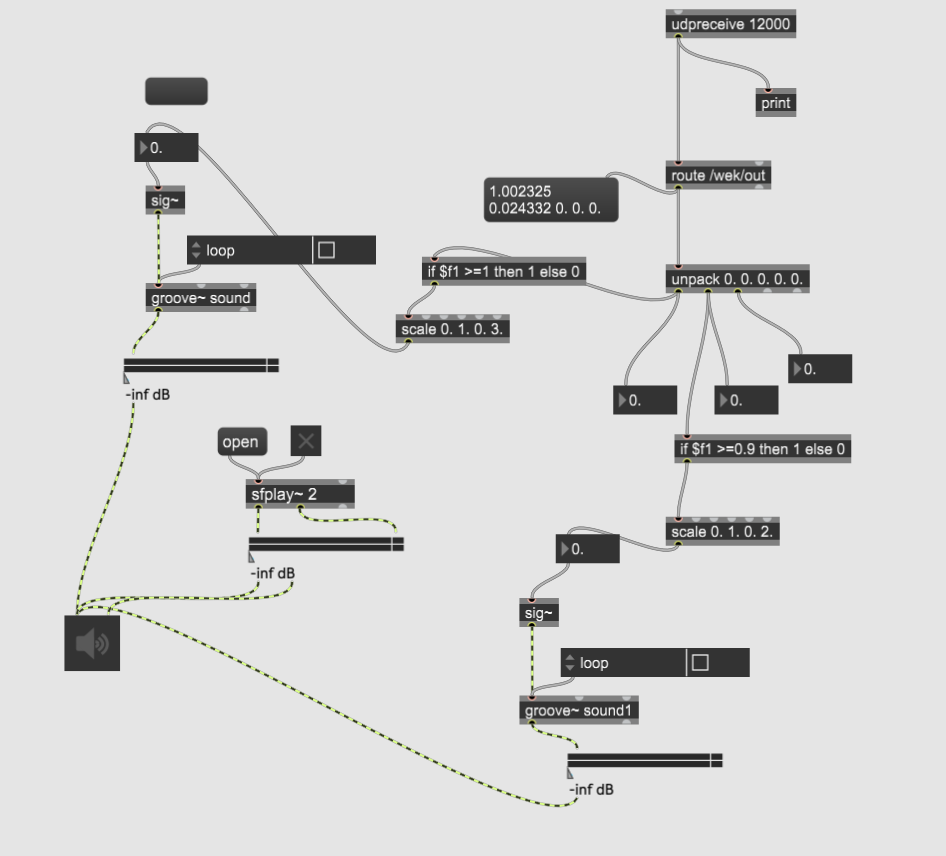

## Task 4. Interaction design (inputs)

For this task Francisca and I partnered to play with different inputs. We both wanted to use the body as an input to eventually control some outputs. 

### 1.	Discovering the tools

<figure markdown>
  { width="500" } 
</figure>

First, we started by playing with Weakinator, a new tool for machine learning that can take different inputs to learn patterns. In this case we started by facial expressions using the webcam.
It took several takes for it to start recognizing and differentiating the facial expressions, but we were surprised on how easy it is to handle. 

<figure markdown>
  { width="500" } 
</figure>

### 2.	Building sensor

We tried to build a soft sensor made out of fabric that was provided for the task. We tried with the pressure sensor in order to trigger some actions when certain values where obtained. But, after talking with Citlali, she suggested for us to work with the phones sensors to get more possibilities.

<figure markdown>
  { width="500" } 
</figure>

### 3.	Hacking our phones to read Sensors.
Once we could choose the variables and teach the weakinator, we aked Citlali about the detect body movements to use them as inputs. She mentioned that developing sensors from scratch demands time and sometimes they can not as accurate as expected. For the time frame we had she suggested to use the sensors our phones already have.

To be able to access the sensors we had to download SIG ZIM (ios), an application that allows you to obtain the data from the different sensors in your phone. In this case we wanted to obtain the data form the gyroscope or accelerometer.

Through various attempts we were able to obtain the data, send it to Weakinator and train the machine. But as these sensors are very sensible and oscillate a lot, they are not very accurate on what we wanted to obtain, which was for it to recognize specific movements. 

## Task 5. Interaction design (outputs)

For this task we focused on keeping developing the inputs with body movements for then processing them and control some outputs.

### 1.	Phone sensor reading (from accel to quaternion)

Our classmate Carmen suggested us to try with the quaternion sensor which encodes information about an axis-angle rotation about an arbitrary axis. This unit was more accurate and we were able to train a weakinator with a movement that we later used to play with the outputs of the next task.

<figure markdown>
  { width="500" } 
</figure>

### 1.	Discovering the tools

We were introduced to max 8, a software that can be used to process external data to generate or modify visuals and audio. 
In this case we were focused on modifying an audio file with our movements. 

### 1.	Output: interactive audio

As we did before, we used the quaternion sensor to train a specific movement on wekinator, which was later detected through the IP address by Max 8. 
After many attempts we were able to control the speed of an audio according to the inclination of our phone.

<figure markdown>
  { width="500" } 
</figure>

