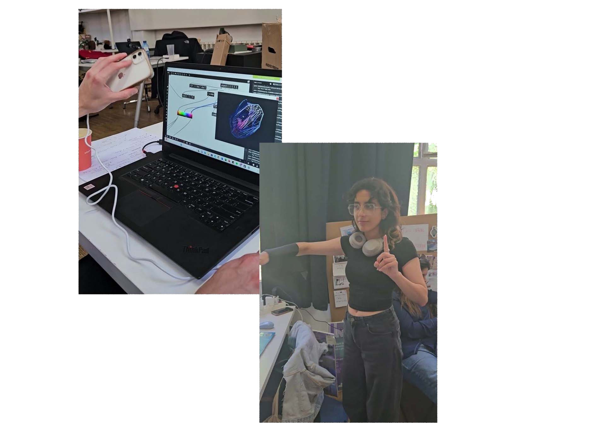

## interaVOGUE: To modify existent visuals with sensors in a two persons interactive dance experience

<figure markdown>
  
</figure>

### Reflection

This microchallenge was an opportunity for Francisca and me to explore the performative arts including interactive assets. For us it was a sum of the past two tasks we had been part of where we learned to generate inputs with data from our body movements and outputs with a specialized software.

As we are very passionate about dancing and the act of perform to be able to explore these tools, despite the time frame we had, opened up a new door for us for body movements detection and data capture as well as the processing this data into sounds and visuals.

For sure I can see myself further exploring these tools and building something out of them. Next step would be to learn how to fabricate personalized wearable sensors that are comfortable and resistant in the act of performing.

Till next time😉

### Check out the Github Repository here: 

https://github.com/everardocastro/Microchallenge-3/tree/main

